# Casos de uso y modelo de datos

Plataforma de Gestión de Torneos — Torneos Baloncesto Manta.

Todo sale del código (`backend/app/models`, `services`, `routes`) en el commit `4e9f0f9`, no de la documentación previa. Donde ambos difieren, manda el código; las diferencias están en la sección 4.

## 1. Actores

| Actor | Quién es | Cómo se identifica |
|---|---|---|
| **Público** | Cualquier visitante | Sin sesión |
| **Delegado** | Responsable de un club. Es el rol por defecto al registrarse | JWT de Supabase + `usuarios.rol = 'delegado'` |
| **Super Admin** | Organización del torneo | JWT de Supabase + `usuarios.rol = 'super_admin'` |
| **Supabase Auth** | Sistema externo: registro, login y recuperación de clave | Trigger `sync_user_to_public` en `auth.users` |

## 2. Diagrama ERD

Todas las tablas tienen además `created_at` y `updated_at`. Las reglas marcadas "(app)" se validan en los servicios, no en la base de datos.

```mermaid
erDiagram
    USUARIOS ||--o{ EQUIPOS : "administra"
    TORNEOS |o--o{ CATEGORIAS : "define"
    TORNEOS ||--o{ INSCRIPCIONES : "recibe"
    EQUIPOS ||--o{ INSCRIPCIONES : "solicita"
    CATEGORIAS ||--o{ INSCRIPCIONES : "clasifica"
    TORNEOS ||--o{ PLANTILLAS : "habilita"
    EQUIPOS ||--o{ PLANTILLAS : "alinea"
    JUGADORES ||--o{ PLANTILLAS : "integra"
    CATEGORIAS |o--o{ PLANTILLAS : "ubica"
    TORNEOS ||--o{ PARTIDOS : "programa"
    CATEGORIAS ||--o{ PARTIDOS : "agrupa"
    EQUIPOS ||--o{ PARTIDOS : "juega de local"
    EQUIPOS ||--o{ PARTIDOS : "juega de visitante"
    PARTIDOS ||--o{ ESTADISTICAS : "registra"
    JUGADORES ||--o{ ESTADISTICAS : "acumula"
    PARTIDOS ||--o{ SANCIONES : "origina"
    JUGADORES ||--o{ SANCIONES : "recibe"
    TORNEOS ||--o{ DOCUMENTACION : "publica"
    JUGADORES ||--o{ DOCUMENTOS_JUGADORES : "adjunta"
    PATROCINADORES ||--o{ PATROCINADORES_TORNEOS : "auspicia"
    TORNEOS ||--o{ PATROCINADORES_TORNEOS : "recibe auspicio"

    USUARIOS {
        string id_usuario PK "UUID de Supabase Auth"
        string nombre
        string correo UK
        string rol "super_admin | delegado"
        string estado "activo | inactivo"
    }
    TORNEOS {
        int id_torneo PK
        string nombre
        date fecha_inicio
        date fecha_fin "mayor o igual a fecha_inicio"
        string estado "programado | en_curso | finalizado | inactivo | anulado"
        string url_calendario_excel
    }
    CATEGORIAS {
        int id_categoria PK
        string nombre_categoria
        string genero_categoria "masculino | femenino"
        int edad_minima "default 0"
        int edad_maxima "NULL = sin tope"
        int id_torneo FK "nullable, ON DELETE CASCADE"
    }
    EQUIPOS {
        int id_equipo PK
        string nombre_equipo "en MAYÚSCULAS (app)"
        string estado "activo | inactivo"
        text url_logo
        text url_foto_equipo "banner"
        string id_usuario FK "delegado dueño"
    }
    JUGADORES {
        int id_jugador PK
        string nombre
        string genero "masculino | femenino | NULL"
        string documento_identificacion UK "cédula"
        date fecha_nacimiento
        text url_foto
        text url_cedula
        text url_acta_bachiller
        string correo
        string telefono
        string estado "activo | inactivo"
    }
    INSCRIPCIONES {
        int id_inscripcion PK
        datetime fecha_inscripcion
        string estado_inscripcion "borrador | pendiente | aprobado | rechazado | retirado"
        string grupo
        text url_comprobante_pago
        int id_torneo FK "UK compuesta torneo+equipo+categoría"
        int id_equipo FK
        int id_categoria FK
    }
    PLANTILLAS {
        int id_plantilla PK
        int numero_camiseta "0-99, único por equipo+torneo+categoría (app)"
        int id_jugador FK
        int id_torneo FK
        int id_equipo FK
        int id_categoria FK "nullable"
        string estado "activo | inactivo"
    }
    PARTIDOS {
        int id_partido PK
        date fecha
        time hora
        string estado "programado | en_curso | finalizado | finalizado_wo | suspendido | anulado"
        int marcador_local
        int marcador_visitante
        string fase
        string ubicacion "default Coliseo Pablo Delgado Álava"
        text url_planilla_fiba "acta del partido"
        boolean stats_local_procesadas
        boolean stats_visitante_procesadas
        int id_torneo FK
        int id_categoria FK
        int id_equipo_local FK
        int id_equipo_visitante FK "distinto del local (app)"
    }
    ESTADISTICAS {
        int id_estadistica PK
        int puntos_anotados
        int faltas_cometidas
        int triples_anotados
        int rebotes
        int asistencias
        int tiros_libres_anotados
        int valoracion
        int tapones
        int robos
        int id_partido FK "UK compuesta partido+jugador"
        int id_jugador FK
    }
    SANCIONES {
        int id_sancion PK
        text motivo "tecnica | antideportiva | descalificante | texto libre"
        date fecha
        string estado "activa | inactiva"
        int id_jugador FK
        int id_partido FK
    }
    DOCUMENTACION {
        int id_documentacion PK
        string titulo
        text url_documento
        int id_torneo FK
    }
    DOCUMENTOS_JUGADORES {
        int id_documentos_jugador PK
        text url_documento
        string tipo_documento "cédula | certificado_estudios"
        string estado_validacion "pendiente | aprobado | rechazado"
        int id_jugador FK
    }
    PATROCINADORES {
        int id_patrocinador PK
        string nombre_patrocinador
        text url_logo_patrocinador
        text url_imagen_promocional
    }
    PATROCINADORES_TORNEOS {
        int id_patrocinador_torneo PK
        int id_patrocinador FK
        int id_torneo FK
    }
```

**Relación lógica que no está en el diagrama.** `PLANTILLAS` no tiene FK hacia `INSCRIPCIONES`. Se enlazan por la combinación `(id_equipo, id_torneo, id_categoria)`: una fila de plantilla solo es válida si existe una inscripción viva con esos tres valores.

**Qué tablas participan en la lógica.** El núcleo son `inscripciones`, `plantillas` y `partidos`, y alrededor giran `estadisticas` y `sanciones`. `documentacion` y `patrocinadores_torneos` no tienen endpoints. `documentos_jugadores` solo se toca al purgar datos (ver 3.12).

## 3. Casos de uso por entidad

Convención de los diagramas: los círculos son actores, las cápsulas son casos de uso y las flechas punteadas marcan `include` o `extend`.

### 3.1 Usuario

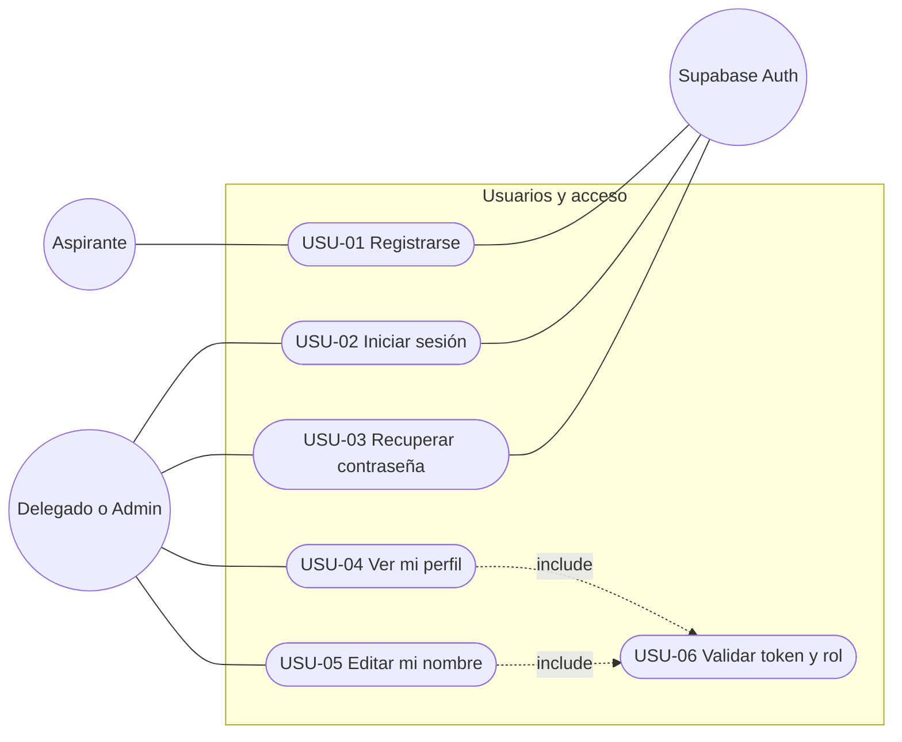
```mermaid
flowchart LR
    ASP((Aspirante))
    USR((Delegado o Admin))
    subgraph SYS["Usuarios y acceso"]
        U1([USU-01 Registrarse])
        U2([USU-02 Iniciar sesión])
        U3([USU-03 Recuperar contraseña])
        U4([USU-04 Ver mi perfil])
        U5([USU-05 Editar mi nombre])
        U6([USU-06 Validar token y rol])
    end
    SUPA((Supabase Auth))
    ASP --- U1
    USR --- U2
    USR --- U3
    USR --- U4
    USR --- U5
    U1 --- SUPA
    U2 --- SUPA
    U3 --- SUPA
    U4 -. include .-> U6
    U5 -. include .-> U6
```

| ID | Caso de uso | Actor | Endpoint | Reglas de negocio |
|---|---|---|---|---|
| USU-01 | Registrarse | Aspirante, Supabase Auth | `POST {SUPABASE}/auth/v1/signup` | El trigger crea la fila en `usuarios` con rol `delegado` y estado `activo`. La base de datos no guarda contraseñas. |
| USU-02 | Iniciar sesión | Delegado, Admin | `POST {SUPABASE}/auth/v1/token?grant_type=password` | Supabase emite el JWT; el front lo guarda junto con el rol y lo manda como `Bearer`. Cualquier 401 o 403 borra la sesión. |
| USU-03 | Recuperar contraseña | Delegado, Admin | `POST /auth/v1/recover`, `PUT /auth/v1/user` | Todo el flujo ocurre en Supabase. |
| USU-04 | Ver mi perfil | Autenticado | `GET /api/usuarios/me` | — |
| USU-05 | Editar mi nombre | Autenticado | `PUT /api/usuarios/me` | Solo se puede cambiar `nombre`. El rol y el estado no tienen endpoint y se cambian en la base de datos. |
| USU-06 | Validar token y rol (sistema) | Middleware | `@token_required` | Verifica ES256 con JWKS y, si falla, HS256. Exige los claims `sub` y `exp`. Con `allowed_roles`, el usuario debe existir y estar `activo`; si está inactivo responde 403. |

### 3.2 Torneo

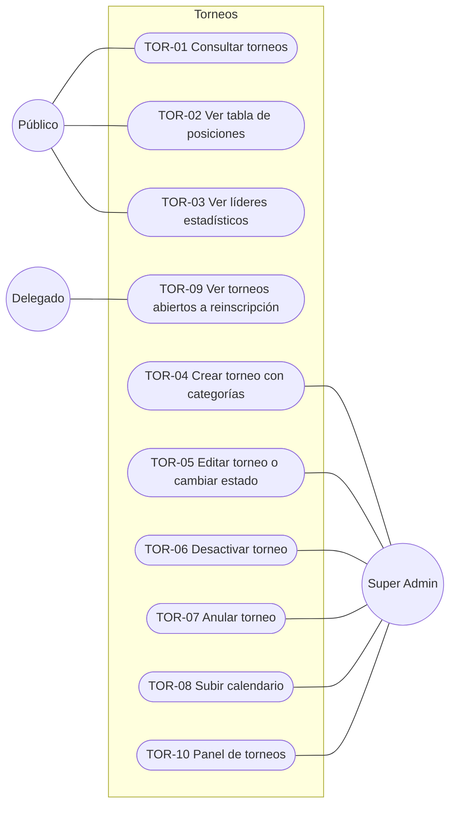
```mermaid
flowchart LR
    PUB((Público))
    DEL((Delegado))
    subgraph SYS["Torneos"]
        T1([TOR-01 Consultar torneos])
        T2([TOR-02 Ver tabla de posiciones])
        T3([TOR-03 Ver líderes estadísticos])
        T9([TOR-09 Ver torneos abiertos a reinscripción])
        T4([TOR-04 Crear torneo con categorías])
        T5([TOR-05 Editar torneo o cambiar estado])
        T6([TOR-06 Desactivar torneo])
        T7([TOR-07 Anular torneo])
        T8([TOR-08 Subir calendario])
        T10([TOR-10 Panel de torneos])
    end
    ADM((Super Admin))
    PUB --- T1
    PUB --- T2
    PUB --- T3
    DEL --- T9
    T4 --- ADM
    T5 --- ADM
    T6 --- ADM
    T7 --- ADM
    T8 --- ADM
    T10 --- ADM
```

| ID | Caso de uso | Actor | Endpoint | Reglas de negocio |
|---|---|---|---|---|
| TOR-01 | Consultar torneos | Público | `GET /api/torneos?anio=`, `GET /api/torneos/<id>` | Oculta los torneos `inactivo` y `anulado`. Ordena por fecha de inicio, del más reciente al más antiguo. |
| TOR-02 | Ver tabla de posiciones | Público | `GET /api/torneos/<id>/posiciones` | Se calcula en cada consulta con los partidos `finalizado` y `finalizado_wo`. Victoria 2 puntos, derrota 1, derrota por W.O. 0. Un W.O. con marcador 0-0 cuenta como 20-0 a favor del local. Desempate: puntos, enfrentamiento directo, diferencia (DIF), puntos a favor (PF). Si el marcador queda empatado, gana el local. |
| TOR-03 | Ver líderes estadísticos | Público | `GET /api/torneos/<id>/lideres` | Top 10 en puntos, triples, rebotes, asistencias, tapones y tiros libres. Solo cuenta partidos finalizados. |
| TOR-04 | Crear torneo con categorías | Admin | `POST /api/torneos` | `fecha_fin` debe ser igual o posterior a `fecha_inicio`. El torneo y sus categorías se crean en una sola transacción. |
| TOR-05 | Editar torneo o cambiar estado | Admin | `PUT /api/torneos/<id>` | Revisa las fechas combinando el valor nuevo con el guardado. Estados permitidos: `programado`, `en_curso`, `finalizado`, `anulado`. |
| TOR-06 | Desactivar torneo | Admin | `DELETE /api/torneos/<id>` | Borrado lógico: pasa a `inactivo`. |
| TOR-07 | Anular torneo | Admin | `PUT /api/torneos/<id>/anular` | Pasa a `anulado`: desaparece de la vista pública y conserva su historial. |
| TOR-08 | Subir calendario | Admin | `POST /api/torneos/<id>/calendario` | Acepta PDF, XLS o XLSX de hasta 5 MB. El tipo se valida por magic bytes. |
| TOR-09 | Ver torneos abiertos a reinscripción | Delegado | `GET /api/torneos/disponibles-reinscripcion` | Solo lista torneos `programado`. |
| TOR-10 | Panel de torneos | Admin | `GET /api/torneos/admin` | Incluye todos los estados. |

### 3.3 Categoría

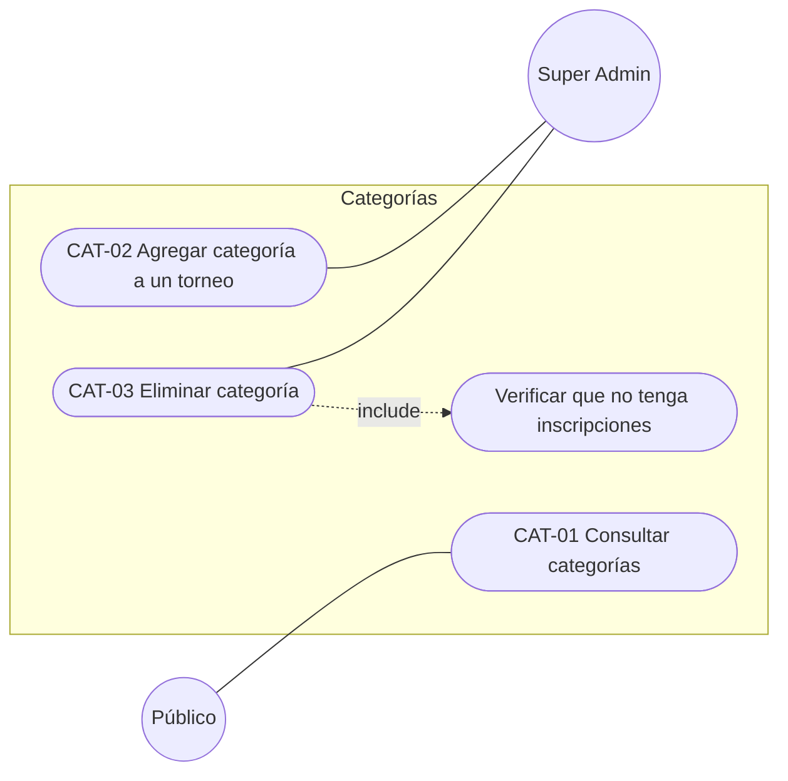
```mermaid
flowchart LR
    PUB((Público))
    subgraph SYS["Categorías"]
        C1([CAT-01 Consultar categorías])
        C2([CAT-02 Agregar categoría a un torneo])
        C3([CAT-03 Eliminar categoría])
        C4([Verificar que no tenga inscripciones])
    end
    ADM((Super Admin))
    PUB --- C1
    C2 --- ADM
    C3 --- ADM
    C3 -. include .-> C4
```

| ID | Caso de uso | Actor | Endpoint | Reglas de negocio |
|---|---|---|---|---|
| CAT-01 | Consultar categorías | Público | `GET /api/categorias?genero=&id_torneo=`, `GET /api/categorias/<id>` | Ordena por género y luego por edad mínima. |
| CAT-02 | Agregar categoría a un torneo | Admin | `POST /api/torneos/<id>/categorias` | Género `masculino` o `femenino`. `edad_minima` vale 0 por defecto. Si `edad_maxima` es NULL, no hay tope (ej. "+30"). |
| CAT-03 | Eliminar categoría | Admin | `DELETE /api/torneos/categorias/<id>` | Se bloquea si la categoría tiene inscripciones. Si no las tiene, se borra físicamente. |

La edad deportiva se calcula como **año actual menos año de nacimiento**, sin mirar día ni mes. Esa edad es la que se compara con el rango de la categoría (PLA-02).

### 3.4 Equipo

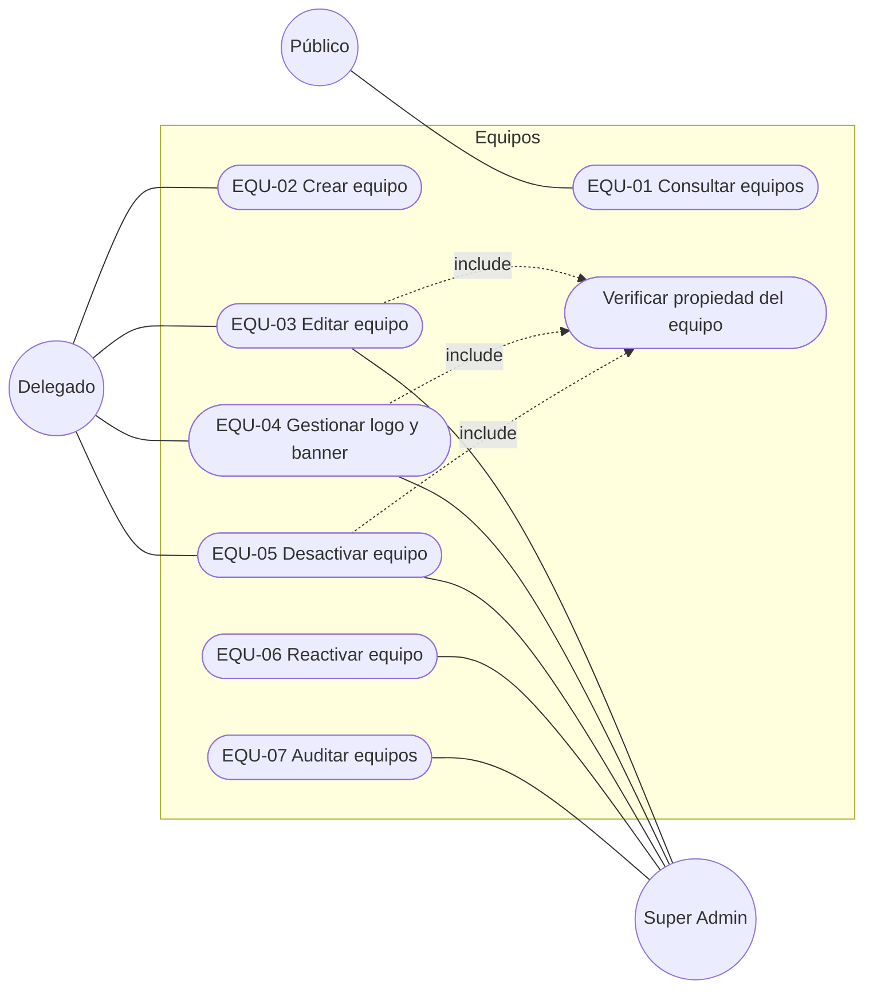
```mermaid
flowchart LR
    PUB((Público))
    DEL((Delegado))
    subgraph SYS["Equipos"]
        E1([EQU-01 Consultar equipos])
        E2([EQU-02 Crear equipo])
        E3([EQU-03 Editar equipo])
        E4([EQU-04 Gestionar logo y banner])
        E5([EQU-05 Desactivar equipo])
        E6([EQU-06 Reactivar equipo])
        E7([EQU-07 Auditar equipos])
        E8([Verificar propiedad del equipo])
    end
    ADM((Super Admin))
    PUB --- E1
    DEL --- E2
    DEL --- E3
    DEL --- E4
    DEL --- E5
    E3 --- ADM
    E4 --- ADM
    E5 --- ADM
    E6 --- ADM
    E7 --- ADM
    E3 -. include .-> E8
    E4 -. include .-> E8
    E5 -. include .-> E8
```

| ID | Caso de uso | Actor | Endpoint | Reglas de negocio |
|---|---|---|---|---|
| EQU-01 | Consultar equipos | Público | `GET /api/equipos`, `GET /api/equipos/<id>` | Solo muestra equipos activos. |
| EQU-02 | Crear equipo | Delegado | `POST /api/equipos` | El nombre se guarda en MAYÚSCULAS. `id_usuario` se toma del JWT, nunca del body. Límite: **1 equipo activo por delegado** (`MAX_EQUIPOS_POR_DELEGADO`). |
| EQU-03 | Editar equipo | Delegado dueño, Admin | `PUT /api/equipos/<id>` | Anti-IDOR: un delegado solo puede editar sus propios equipos. |
| EQU-04 | Gestionar logo y banner | Delegado dueño, Admin | `POST` y `DELETE /api/equipos/<id>/logo`, `.../banner` | JPG, PNG o WebP. Logo hasta 2 MB, banner hasta 5 MB. |
| EQU-05 | Desactivar equipo | Delegado dueño, Admin | `DELETE /api/equipos/<id>` | Borrado lógico: pasa a `inactivo`. |
| EQU-06 | Reactivar equipo | Admin | `PUT /api/equipos/<id>/reactivar` | Falla si el delegado ya tiene otro equipo activo. |
| EQU-07 | Auditar equipos | Admin | `GET /api/equipos/admin/list` | Filtra por torneo, categoría, texto y estado. |

### 3.5 Jugador

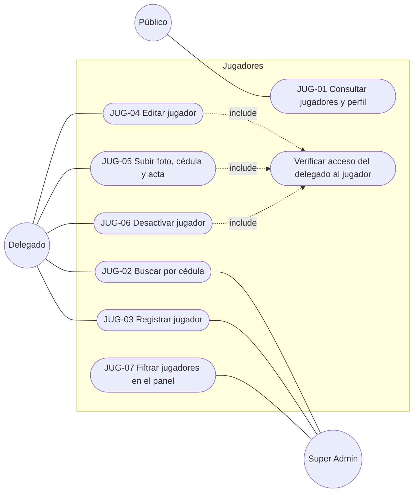
```mermaid
flowchart LR
    PUB((Público))
    DEL((Delegado))
    subgraph SYS["Jugadores"]
        J1([JUG-01 Consultar jugadores y perfil])
        J2([JUG-02 Buscar por cédula])
        J3([JUG-03 Registrar jugador])
        J4([JUG-04 Editar jugador])
        J5([JUG-05 Subir foto, cédula y acta])
        J6([JUG-06 Desactivar jugador])
        J7([JUG-07 Filtrar jugadores en el panel])
        J8([Verificar acceso del delegado al jugador])
    end
    ADM((Super Admin))
    PUB --- J1
    DEL --- J2
    DEL --- J3
    DEL --- J4
    DEL --- J5
    DEL --- J6
    J2 --- ADM
    J3 --- ADM
    J7 --- ADM
    J4 -. include .-> J8
    J5 -. include .-> J8
    J6 -. include .-> J8
```

| ID | Caso de uso | Actor | Endpoint | Reglas de negocio |
|---|---|---|---|---|
| JUG-01 | Consultar jugadores y perfil | Público | `GET /api/jugadores`, `GET /api/jugadores/<id>`, `GET /api/jugadores/<id>/perfil` | El perfil muestra participaciones por torneo y equipo y sus estadísticas. Ojo: estos endpoints exponen datos personales (hallazgo 1). |
| JUG-02 | Buscar por cédula | Delegado, Admin | `GET /api/jugadores/buscar` | Sirve para reutilizar un jugador que ya existe y avisar si ya está en otra plantilla del mismo torneo o categoría. |
| JUG-03 | Registrar jugador | Delegado, Admin | `POST /api/jugadores` | La cédula es única: si se repite, responde 409 y devuelve el jugador existente. Nombre, cédula y teléfono se guardan en MAYÚSCULAS. El género es opcional. |
| JUG-04 | Editar jugador | Delegado con acceso, Admin | `PUT /api/jugadores/<id>` | Un delegado tiene acceso si el jugador está activo en una plantilla de su equipo o si no está en ninguna plantilla activa (jugador libre). |
| JUG-05 | Subir foto, cédula y acta de bachiller | Delegado con acceso, Admin | `POST /api/jugadores/<id>/foto`, `.../cedula`, `.../acta` | Hasta 4 MB por archivo, validado por magic bytes. Al reemplazar un archivo se borra el anterior del storage. |
| JUG-06 | Desactivar jugador | Delegado con acceso, Admin | `DELETE /api/jugadores/<id>` | Borrado lógico: pasa a `inactivo`. |
| JUG-07 | Filtrar jugadores en el panel | Admin | `GET /api/jugadores?admin=true&search=&id_torneo=&id_equipo=&estado=` | Busca por nombre o cédula y filtra por plantilla activa. |

### 3.6 Inscripción

Es el proceso central del sistema: un wizard de dos pasos, auditoría del admin y un ciclo de vida con borrado físico en el rechazo.

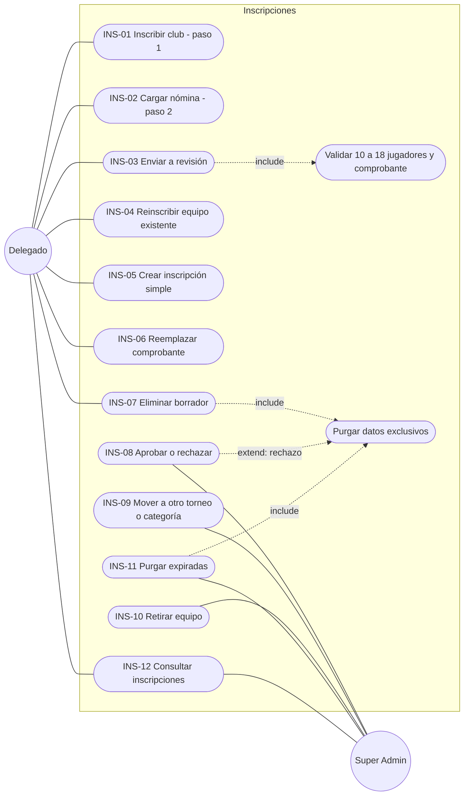
```mermaid
flowchart LR
    DEL((Delegado))
    subgraph SYS["Inscripciones"]
        I1([INS-01 Inscribir club - paso 1])
        I2([INS-02 Cargar nómina - paso 2])
        I3([INS-03 Enviar a revisión])
        I4([INS-04 Reinscribir equipo existente])
        I5([INS-05 Crear inscripción simple])
        I6([INS-06 Reemplazar comprobante])
        I7([INS-07 Eliminar borrador])
        I12([INS-12 Consultar inscripciones])
        I8([INS-08 Aprobar o rechazar])
        I9([INS-09 Mover a otro torneo o categoría])
        I10([INS-10 Retirar equipo])
        I11([INS-11 Purgar expiradas])
        V([Validar 10 a 18 jugadores y comprobante])
        P([Purgar datos exclusivos])
    end
    ADM((Super Admin))
    DEL --- I1
    DEL --- I2
    DEL --- I3
    DEL --- I4
    DEL --- I5
    DEL --- I6
    DEL --- I7
    DEL --- I12
    I8 --- ADM
    I9 --- ADM
    I10 --- ADM
    I11 --- ADM
    I12 --- ADM
    I3 -. include .-> V
    I7 -. include .-> P
    I8 -. "extend: rechazo" .-> P
    I11 -. include .-> P
```

| ID | Caso de uso | Actor | Endpoint | Reglas de negocio |
|---|---|---|---|---|
| INS-01 | Inscribir club (paso 1) | Delegado | `POST /api/inscripciones/completa` (multipart) | En una sola transacción crea el equipo, la inscripción en `borrador`, sube el comprobante (PDF o imagen, hasta 5 MB) y el logo opcional. Si algo falla, borra los archivos subidos. Límites: 1 equipo activo y **1 borrador a la vez** por delegado. |
| INS-02 | Cargar nómina (paso 2) | Delegado | ver PLA-02 | Se puede cargar mientras la inscripción está en `borrador`. |
| INS-03 | Enviar a revisión | Delegado dueño, Admin | `POST /api/inscripciones/<id>/finalizar-borrador` | Exige comprobante y entre **10 y 18 jugadores activos**. Pasa de `borrador` a `pendiente`. |
| INS-04 | Reinscribir equipo existente | Delegado, Admin | `POST /api/inscripciones/reinscribir` | Nace en `borrador`. Opcionalmente clona la plantilla de la última inscripción no rechazada del equipo, conservando los dorsales. |
| INS-05 | Crear inscripción simple | Delegado, Admin | `POST /api/inscripciones` | El torneo no puede estar `inactivo`, `en_curso` ni `finalizado`. El equipo debe estar activo. La combinación torneo+equipo+categoría es única (si se repite, responde 409). |
| INS-06 | Reemplazar comprobante | Delegado, Admin | `POST /api/inscripciones/<id>/comprobante` | Mismas validaciones de archivo que INS-01. |
| INS-07 | Eliminar borrador | Delegado dueño | `DELETE /api/inscripciones/<id>` | Solo si está en `borrador`. Ejecuta la purga física (ver "Purgar datos exclusivos" más abajo). |
| INS-08 | Aprobar o rechazar | Admin | `PATCH /api/inscripciones/<id>/estado` | Aprobar pasa la inscripción a `aprobado`. **Rechazar no cambia el estado: borra la inscripción** y ejecuta la purga. El body acepta `borrador`, `pendiente`, `aprobado` y `rechazado` desde cualquier estado. |
| INS-09 | Mover a otro torneo o categoría | Admin | `PATCH /api/inscripciones/<id>/editar` | Solo si el torneo actual no está en curso ni finalizado. El destino debe estar `programado` y no puede haber duplicado. La plantilla se mueve con la inscripción. |
| INS-10 | Retirar equipo | Admin | `PUT /api/inscripciones/<id>/retirar` | Solo desde `aprobado`; pasa a `retirado`. Borra los partidos `programado` del equipo en ese torneo y conserva los ya jugados. |
| INS-11 | Purgar expiradas | Admin | `POST /api/inscripciones/purgar-expiradas` | Borra borradores y rechazadas con más de 30 días sin cambios. |
| INS-12 | Consultar inscripciones | Público, Delegado, Admin | `GET /api/inscripciones/publicas`, `GET /api/inscripciones` | Los borradores se excluyen salvo que se pidan explícitamente. |

**Purgar datos exclusivos**, la regla que comparten INS-07, INS-08 (rechazo) e INS-11:

1. Borra las plantillas del equipo en ese torneo.
2. Borra a los jugadores que quedan sin otras plantillas, sanciones ni estadísticas, junto con su foto, cédula y acta.
3. Borra el comprobante y la inscripción.
4. Si el equipo no tiene otras inscripciones, borra también el equipo y su logo.

Así se liberan el cupo del delegado y las cédulas.

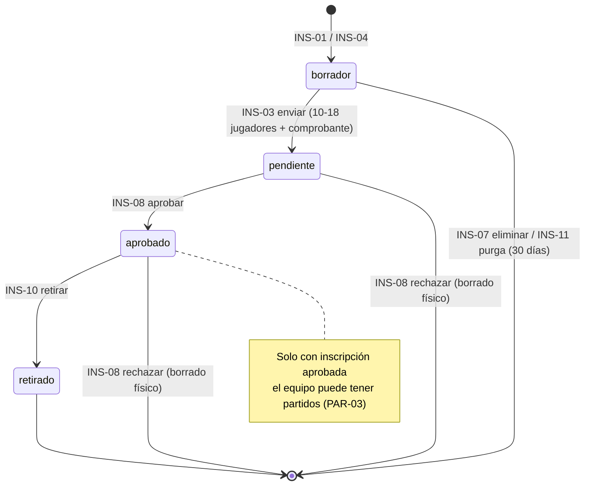
```mermaid
stateDiagram-v2
    [*] --> borrador: INS-01 / INS-04
    borrador --> pendiente: INS-03 enviar (10-18 jugadores + comprobante)
    borrador --> [*]: INS-07 eliminar / INS-11 purga (30 días)
    pendiente --> aprobado: INS-08 aprobar
    pendiente --> [*]: INS-08 rechazar (borrado físico)
    aprobado --> retirado: INS-10 retirar
    aprobado --> [*]: INS-08 rechazar (borrado físico)
    retirado --> [*]
    note right of aprobado
        Solo con inscripción aprobada
        el equipo puede tener partidos (PAR-03)
    end note
```

### 3.7 Plantilla (nómina)

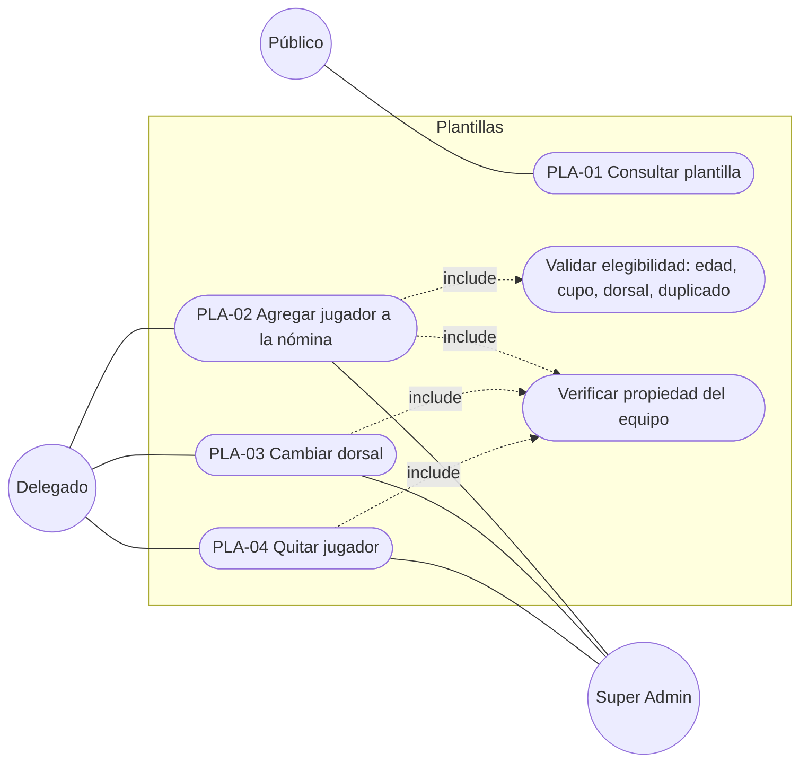
```mermaid
flowchart LR
    PUB((Público))
    DEL((Delegado))
    subgraph SYS["Plantillas"]
        L1([PLA-01 Consultar plantilla])
        L2([PLA-02 Agregar jugador a la nómina])
        L3([PLA-03 Cambiar dorsal])
        L4([PLA-04 Quitar jugador])
        L5([Validar elegibilidad: edad, cupo, dorsal, duplicado])
        L6([Verificar propiedad del equipo])
    end
    ADM((Super Admin))
    PUB --- L1
    DEL --- L2
    DEL --- L3
    DEL --- L4
    L2 --- ADM
    L3 --- ADM
    L4 --- ADM
    L2 -. include .-> L5
    L2 -. include .-> L6
    L3 -. include .-> L6
    L4 -. include .-> L6
```

| ID | Caso de uso | Actor | Endpoint | Reglas de negocio |
|---|---|---|---|---|
| PLA-01 | Consultar plantilla | Público | `GET /api/plantillas?id_equipo=&id_torneo=&id_categoria=`, `GET /api/plantillas/<id>` | Solo entradas activas, ordenadas por dorsal. |
| PLA-02 | Agregar jugador a la nómina | Delegado dueño, Admin | `POST /api/plantillas` | Validaciones en este orden: **1)** un delegado no puede agregar jugadores si el torneo está `en_curso`; **2)** debe existir una inscripción `borrador`, `pendiente` o `aprobado` para ese equipo, torneo y categoría; **3)** máximo 18 jugadores activos; **4)** el jugador debe estar activo y su edad deportiva dentro del rango de la categoría; **5)** el jugador no puede estar ya en esa categoría del torneo con otro equipo aprobado; **6)** dorsal de 0 a 99, único en el equipo para ese torneo y categoría. |
| PLA-03 | Cambiar dorsal | Delegado dueño, Admin | `PATCH /api/plantillas/<id>` | El dorsal no puede estar en uso en el mismo equipo y torneo. |
| PLA-04 | Quitar jugador | Delegado dueño, Admin | `DELETE /api/plantillas/<id>` | Borrado lógico: pasa a `inactivo`. El jugador queda libre para otros equipos. |

### 3.8 Partido

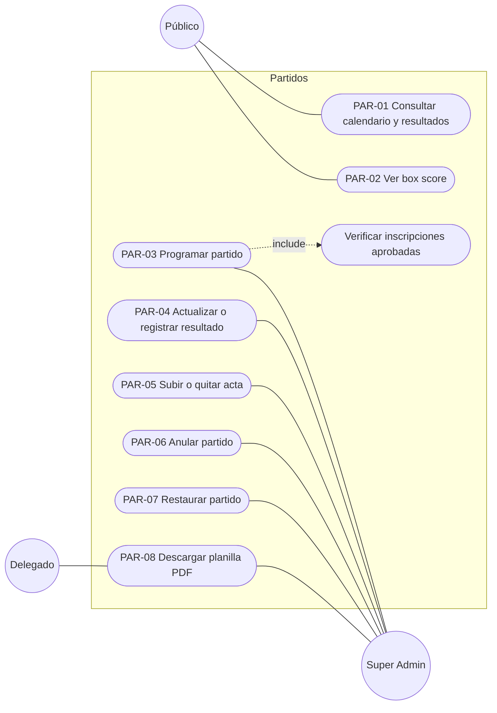
```mermaid
flowchart LR
    PUB((Público))
    DEL((Delegado))
    subgraph SYS["Partidos"]
        M1([PAR-01 Consultar calendario y resultados])
        M2([PAR-02 Ver box score])
        M8([PAR-08 Descargar planilla PDF])
        M3([PAR-03 Programar partido])
        M4([PAR-04 Actualizar o registrar resultado])
        M5([PAR-05 Subir o quitar acta])
        M6([PAR-06 Anular partido])
        M7([PAR-07 Restaurar partido])
        M9([Verificar inscripciones aprobadas])
    end
    ADM((Super Admin))
    PUB --- M1
    PUB --- M2
    DEL --- M8
    M3 --- ADM
    M4 --- ADM
    M5 --- ADM
    M6 --- ADM
    M7 --- ADM
    M8 --- ADM
    M3 -. include .-> M9
```

| ID | Caso de uso | Actor | Endpoint | Reglas de negocio |
|---|---|---|---|---|
| PAR-01 | Consultar calendario y resultados | Público | `GET /api/partidos?id_torneo=&estados=&id_equipo=&id_categoria=&pendientes_stats=&search=&sort_order=`, `GET /api/partidos/<id>` | Oculta los `anulado` salvo que se filtre por estado. |
| PAR-02 | Ver box score | Público | `GET /api/partidos/<id>/estadisticas` | Muestra las plantillas activas de ambos equipos con sus estadísticas, ordenadas por puntos, y marca a quién tiene una sanción activa. |
| PAR-03 | Programar partido | Admin | `POST /api/partidos` | Local y visitante deben ser equipos distintos y **ambos con inscripción `aprobado` en el mismo torneo y categoría**. Ubicación por defecto: Coliseo Pablo Delgado Álava. |
| PAR-04 | Actualizar o registrar resultado | Admin | `PUT /api/partidos/<id>` | Los marcadores no pueden ser negativos. Estados: `programado`, `en_curso`, `finalizado`, `finalizado_wo`, `suspendido`, `anulado`. |
| PAR-05 | Subir o quitar acta | Admin | `POST` y `DELETE /api/partidos/<id>/acta` | PDF o Excel de hasta 5 MB. |
| PAR-06 | Anular partido | Admin | `DELETE /api/partidos/<id>` | Borrado lógico: pasa a `anulado` y deja de contar en la tabla de posiciones. |
| PAR-07 | Restaurar partido | Admin | `POST /api/partidos/<id>/restaurar` | Vuelve a `programado`. |
| PAR-08 | Descargar planilla PDF | Delegado, Admin | `GET /api/reportes/partido/<id>/planilla` | La genera ReportLab en memoria. |

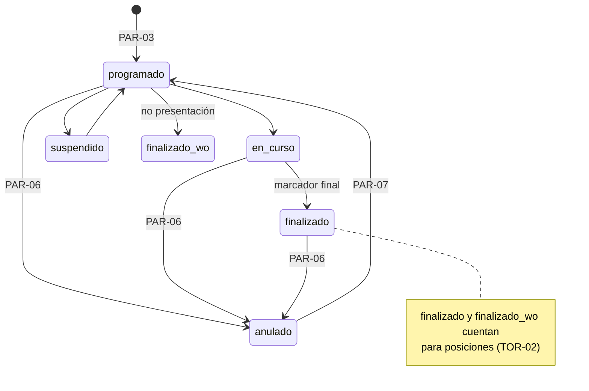
```mermaid
stateDiagram-v2
    [*] --> programado: PAR-03
    programado --> en_curso
    programado --> suspendido
    suspendido --> programado
    en_curso --> finalizado: marcador final
    programado --> finalizado_wo: no presentación
    programado --> anulado: PAR-06
    en_curso --> anulado: PAR-06
    finalizado --> anulado: PAR-06
    anulado --> programado: PAR-07
    note right of finalizado
        finalizado y finalizado_wo cuentan
        para posiciones (TOR-02)
    end note
```

El admin puede fijar cualquier estado con PAR-04; el diagrama muestra el flujo normal.

### 3.9 Estadística

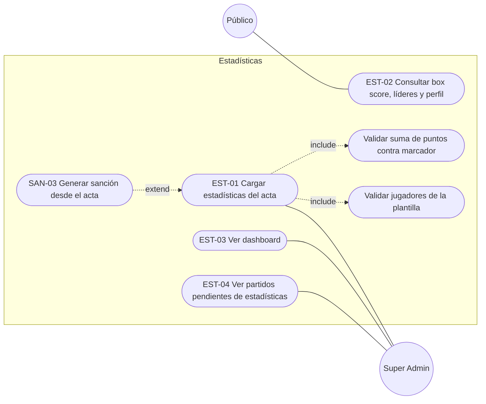
```mermaid
flowchart LR
    PUB((Público))
    subgraph SYS["Estadísticas"]
        S1([EST-01 Cargar estadísticas del acta])
        S2([EST-02 Consultar box score, líderes y perfil])
        S3([EST-03 Ver dashboard])
        S4([EST-04 Ver partidos pendientes de estadísticas])
        S5([Validar suma de puntos contra marcador])
        S6([Validar jugadores de la plantilla])
        S7([SAN-03 Generar sanción desde el acta])
    end
    ADM((Super Admin))
    PUB --- S2
    S1 --- ADM
    S3 --- ADM
    S4 --- ADM
    S1 -. include .-> S5
    S1 -. include .-> S6
    S7 -. extend .-> S1
```

| ID | Caso de uso | Actor | Endpoint | Reglas de negocio |
|---|---|---|---|---|
| EST-01 | Cargar estadísticas del acta | Admin | `POST /api/estadisticas/bulk` | El partido debe estar `en_curso`, `finalizado` o `finalizado_wo`, y el equipo debe haberlo jugado. **La suma de los puntos individuales debe coincidir con el marcador oficial del equipo.** Todos los jugadores deben estar activos en la plantilla del equipo (anti-spoofing). Reemplaza las estadísticas previas de esos jugadores y todo va en una sola transacción. Marca `stats_local_procesadas` o `stats_visitante_procesadas`. |
| EST-02 | Consultar box score, líderes y perfil | Público | ver PAR-02, TOR-03, JUG-01 | Solo cuentan los partidos finalizados. |
| EST-03 | Ver dashboard | Admin | `GET /api/estadisticas/dashboard`, `GET /api/estadisticas/dashboard/actividad-reciente` | — |
| EST-04 | Ver partidos pendientes de estadísticas | Admin | `GET /api/partidos?pendientes_stats=true` | Lista los partidos `finalizado` a los que les falta cargar las estadísticas de un equipo. |

### 3.10 Sanción

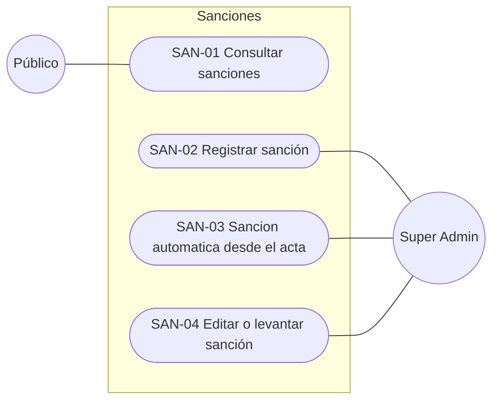
```mermaid
flowchart LR
    PUB((Público))
    subgraph SYS["Sanciones"]
        N1([SAN-01 Consultar sanciones])
        N2([SAN-02 Registrar sanción])
        N3([SAN-03 Sancion automatica desde el acta])
        N4([SAN-04 Editar o levantar sanción])
    end
    ADM((Super Admin))
    PUB --- N1
    N2 --- ADM
    N3 --- ADM
    N4 --- ADM
```

| ID | Caso de uso | Actor | Endpoint | Reglas de negocio |
|---|---|---|---|---|
| SAN-01 | Consultar sanciones | Público | `GET /api/sanciones?id_jugador=&estado=` | Ordenadas por fecha, de la más reciente a la más antigua. |
| SAN-02 | Registrar sanción | Admin | `POST /api/sanciones` | Pide motivo, fecha, jugador y partido. Nace `activa`. |
| SAN-03 | Sanción automática desde el acta | Admin (dentro de EST-01) | `POST /api/estadisticas/bulk` | Si un jugador trae `sancion_tipo` (`tecnica`, `antideportiva` o `descalificante`), se crea la sanción en la misma transacción que las estadísticas. |
| SAN-04 | Editar o levantar sanción | Admin | `PUT /api/sanciones/<id>` | Cambia el motivo o el estado (`activa` a `inactiva`). El box score marca a los jugadores con sanción activa. |

### 3.11 Patrocinador

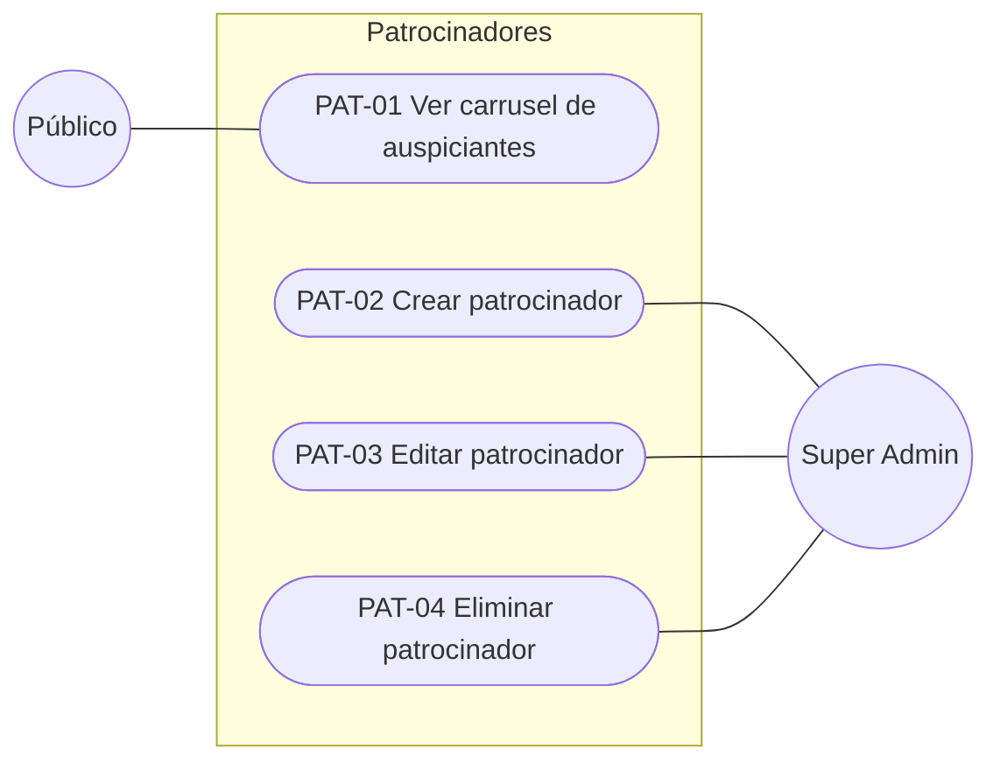
```mermaid
flowchart LR
    PUB((Público))
    subgraph SYS["Patrocinadores"]
        A1([PAT-01 Ver carrusel de auspiciantes])
        A2([PAT-02 Crear patrocinador])
        A3([PAT-03 Editar patrocinador])
        A4([PAT-04 Eliminar patrocinador])
    end
    ADM((Super Admin))
    PUB --- A1
    A2 --- ADM
    A3 --- ADM
    A4 --- ADM
```

| ID | Caso de uso | Actor | Endpoint | Reglas de negocio |
|---|---|---|---|---|
| PAT-01 | Ver carrusel de auspiciantes | Público | `GET /api/patrocinadores` | Los patrocinadores son globales, no pertenecen a un torneo. |
| PAT-02 | Crear patrocinador | Admin | `POST /api/patrocinadores` | Nombre de 1 a 100 caracteres. Logo de hasta 10 MB. |
| PAT-03 | Editar patrocinador | Admin | `PUT /api/patrocinadores/<id>` | — |
| PAT-04 | Eliminar patrocinador | Admin | `DELETE /api/patrocinadores/<id>` | Borrado físico, incluido el logo en el storage. |

### 3.12 Entidades sin casos de uso activos

| Entidad | Estado en el código |
|---|---|
| `PatrocinadorTorneo` | Tabla puente creada pero sin endpoints. Hoy los patrocinadores no se asignan a torneos. |
| `Documentacion` | Pensada para documentos por torneo (reglamento, bases). Sin endpoints. |
| `DocumentoJugador` | Quedó reemplazada por las columnas `url_cedula` y `url_acta_bachiller` de `jugadores`. Solo se lee para borrar archivos al purgar (3.6). |

## 4. Hallazgos: código frente a documentación

1. **Datos personales expuestos (severidad alta).** `GET /api/jugadores/<id>` es público y responde con el schema de admin: cédula, fecha de nacimiento, correo, teléfono y enlaces a la cédula y al acta. `GET /api/jugadores?admin=true`, o con cualquier filtro, hace lo mismo con el listado. Lo comprobé con una llamada sin token. Como producción tiene datos reales, conviene protegerlo con `@token_required` o recortar los campos que devuelve.
2. **Bug: la búsqueda de partidos falla.** `GET /api/partidos?search=...` devuelve 500 porque `partido_service.listar_partidos` usa `Torneo.nombre_torneo`, pero el campo se llama `nombre`.
3. **Límite de equipos.** El código tiene `MAX_EQUIPOS_POR_DELEGADO = 1`, pero el README y `.agents/AGENTS.md` dicen 3.
4. **Quién desactiva equipos.** `AGENTS.md` dice que solo el super_admin puede hacerlo, pero el código deja que el delegado desactive sus propios equipos (EQU-05).
5. **Borrados físicos.** El README promete "cero eliminaciones físicas", pero sí se borran filas al rechazar una inscripción, al eliminar un borrador, al purgar expiradas, al retirar un equipo (sus partidos programados), al eliminar una categoría sin inscripciones y al eliminar un patrocinador.
6. **Nómina editable antes de la aprobación.** `AGENTS.md` dice que la plantilla solo se gestiona con la inscripción aprobada, pero el código lo permite en `borrador`, `pendiente` y `aprobado`. El delegado solo queda bloqueado cuando el torneo está `en_curso`.
7. **Inscripción en torneos anulados.** `crear_inscripcion` solo bloquea `inactivo`, `en_curso` y `finalizado`, así que un torneo `anulado` acepta inscripciones.
8. **Ruta de estadísticas.** `/api/estadisticas/bulk` acepta el rol `delegado`, pero el servicio lo rechaza. En la práctica es solo para el admin.
9. **Tabla de posiciones.** Se calcula en cada consulta. La llamada a `recalcular_tabla` al finalizar o anular un partido no guarda nada, así que ese cálculo se descarta. Un marcador empatado se registra como victoria del local.
10. **Pruebas** (corridas en un sandbox con Python 3.11 y Node 22):
    - Backend: 21 de 33 tests pasan. Fallan por la base de prueba sin tablas y por fechas enviadas como string. Además, `backend/test_error.py` rompe `pytest` si se ejecuta desde `backend/`.
    - Frontend: `tsc` sin errores, Vitest 75 de 81 y `vite build` correcto.
11. **Dependencias.**
    - `package-lock.json` está desincronizado (faltan `@emnapi/*`) y `npm ci` falla.
    - El frontend usa React 19, aunque el README dice 18.
    - El README apunta a una carpeta `documentacion/` que en realidad se llama `Docs/`.
