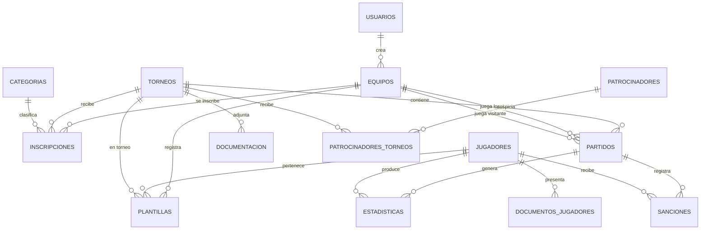

# 🏀 Plataforma de Gestión de Torneos — Exalumnos Salesianos de Manta

Plataforma deportiva moderna para la gestión integral de torneos de baloncesto: inscripción de equipos, validación de documentos, calendario de partidos, estadísticas en vivo y tablas de posiciones automáticas.

> **Proyecto de Vinculación** — Alex Triviño

---

## 📐 Arquitectura

El proyecto utiliza una **arquitectura híbrida desacoplada** con tres capas independientes:

```
┌─────────────────┐       JWT        ┌─────────────────┐     SQLAlchemy     ┌──────────────────┐
│                 │  ─────────────►  │                 │  ───────────────►  │                  │
│   React + Vite  │                  │   Flask API     │                    │   Supabase       │
│   (Vercel)      │  ◄─────────────  │   (Render)      │  ◄───────────────  │   PostgreSQL     │
│                 │     JSON Resp    │                 │     Query Results  │   Auth · Storage │
└────────┬────────┘                  └─────────────────┘                    └──────────────────┘
         │                                                                          ▲
         │              Supabase Auth (Login, Registro, Recuperación)                │
         └──────────────────────────────────────────────────────────────────────────-─┘
```

| Capa | Tecnología | Responsabilidad | Despliegue |
|------|-----------|-----------------|------------|
| **Frontend** | React + Vite + TailwindCSS (última versión estable) | UI/UX, autenticación directa con Supabase, consumo de la API | Vercel |
| **Backend** | Python + Flask + SQLAlchemy | Lógica de negocio, validación JWT, motor estadístico, carga de archivos | Render (gunicorn) |
| **BaaS** | Supabase | PostgreSQL, GoTrue Auth (email), Storage S3 (boto3) | Supabase Cloud |

### Flujo de Datos

1. **Autenticación:** React se comunica directamente con Supabase Auth para login, registro y recuperación de contraseña.
2. **JWT:** Supabase entrega un token JWT al navegador tras el login exitoso.
3. **Operaciones protegidas:** React envía peticiones HTTP a Flask adjuntando el JWT en el header `Authorization: Bearer <token>`.
4. **Validación:** Flask intercepta el JWT con un middleware, verifica la firma matemáticamente y ejecuta la operación en la BD.

> **Nota:** La tabla `Usuarios` en PostgreSQL **NO almacena contraseñas**. La autenticación se delega 100% a Supabase Auth.

---

## 🗂️ Estructura del Proyecto

```
basquet_vinculacion/
├── backend/                          # API REST (Flask + SQLAlchemy)
│   ├── app/
│   │   ├── __init__.py               # App Factory: SQLAlchemy + Migrate + CORS
│   │   ├── models/                   # 14 modelos SQLAlchemy (1 archivo por entidad)
│   │   │   ├── usuario.py            # UUID PK enlazado con Supabase Auth
│   │   │   ├── torneo.py             # Competiciones con fechas y estados
│   │   │   ├── categoria.py          # Género + rango de edad (seeder)
│   │   │   ├── equipo.py             # Clubes gestionados por delegados
│   │   │   ├── jugador.py            # Datos personales + documento único
│   │   │   ├── inscripcion.py        # Pivote Torneo-Equipo-Categoría
│   │   │   ├── plantilla.py          # Nómina Jugador-Equipo-Torneo
│   │   │   ├── partido.py            # Encuentros con marcadores y ubicación
│   │   │   ├── estadistica.py        # Stats FIBA por jugador por partido
│   │   │   ├── sancion.py            # Faltas disciplinarias
│   │   │   ├── documentacion.py      # Documentos generales del torneo
│   │   │   ├── documento_jugador.py  # Cédula y certificados individuales
│   │   │   ├── patrocinador.py       # Auspiciantes
│   │   │   └── patrocinador_torneo.py # Relación N:M Sponsor ↔ Torneo
│   │   ├── routes/                   # Endpoints de la API (blueprints)
│   │   ├── schemas/                  # Validación con Marshmallow
│   │   ├── services/                 # Lógica de negocio (tabla de posiciones, etc.)
│   │   └── utils/
│   │       ├── auth_middleware.py     # Decorador de validación JWT (pendiente)
│   │       └── error_handlers.py     # Respuestas JSON estandarizadas
│   ├── tests/                        # Pruebas con pytest
│   ├── seeders/                      # Datos iniciales (categorías, admin)
│   ├── migrations/                   # Historial Alembic (autogenerado)
│   ├── docs/                         # Swagger / Postman collection
│   ├── .env.example                  # Template de variables de entorno
│   ├── .flake8                       # Reglas de linting Python
│   ├── requirements.txt              # Dependencias pinneadas
│   └── run.py                        # Entry point: python run.py
│
├── frontend/                         # UI (React + Vite) — pendiente Fase 5
│   ├── src/
│   │   ├── components/               # Componentes reutilizables
│   │   ├── context/AuthContext.jsx    # Estado global de sesión
│   │   ├── pages/                    # Vistas (Login, Panel, Público)
│   │   └── services/
│   │       ├── api.js                # Axios con interceptor JWT
│   │       └── supabaseClient.js     # SDK de Supabase Auth
│   └── ...
│
├── documentacion/                    # Docs as Code
│   ├── Arquitectura y entornos.md
│   ├── Documento de requisitos funcionales y no funcionales.md
│   ├── Estructura de carpetas.md
│   ├── Etapas del desarrollo.md
│   ├── Modelado conceptual de la base de datos.md
│   └── Requisitos Borrador.md
│
└── README.md
```

---

## 🗄️ Modelo de Base de Datos

14 entidades conectadas por llaves foráneas estrictas:



### Entidades principales

| Tabla | PK | Campos clave | Soft Delete |
|-------|-----|-------------|-------------|
| `usuarios` | UUID (Supabase) | nombre, correo, rol | ✅ `estado` |
| `torneos` | Auto-increment | nombre, fecha_inicio, fecha_fin | ✅ `estado` |
| `categorias` | Auto-increment | nombre, género, edad_minima, edad_maxima | — (seeder) |
| `equipos` | Auto-increment | nombre_equipo, url_logo, FK→usuario | ✅ `estado` |
| `jugadores` | Auto-increment | documento_id (único), fecha_nacimiento | ✅ `estado` |
| `inscripciones` | Auto-increment | FK→torneo + equipo + categoría, comprobante_pago | ✅ `estado_inscripcion` |
| `plantillas` | Auto-increment | FK→jugador + equipo + torneo, numero_camiseta | ✅ `estado` |
| `partidos` | Auto-increment | marcadores, fase, ubicación (default: Coliseo P.D.Á.) | ✅ `estado` |
| `estadisticas` | Auto-increment | puntos, triples, rebotes, asistencias, faltas | — |
| `sanciones` | Auto-increment | motivo, FK→jugador + partido | ✅ `estado` |
| `documentacion` | Auto-increment | titulo, url_documento, FK→torneo | — |
| `documentos_jugadores` | Auto-increment | tipo_documento, FK→jugador | ✅ `estado_validacion` |
| `patrocinadores` | Auto-increment | nombre, url_logo, url_promocional | — |
| `patrocinadores_torneos` | Auto-increment | FK→patrocinador + torneo | — |

> Todas las tablas incluyen campos de auditoría: `created_at` y `updated_at`.

---

## 👥 Roles y Permisos

El sistema aplica el **Principio de Menor Privilegio** con tres roles:

| Rol | Permisos |
|-----|----------|
| **Super Admin** | Control total: crear torneos, aprobar/rechazar inscripciones y documentos, programar partidos, ingresar estadísticas |
| **Delegado** | Registrar su equipo, subir comprobante de pago, gestionar nómina de jugadores con documentos individuales |
| **Público** | Solo lectura: landing, tablas de posiciones, calendario, líderes estadísticos, carrusel de auspiciantes |

---

## 🏗️ Reglas de Negocio

- **Puntuación:** Ganador = 2 pts, Perdedor = 1 pt. **No hay empates** en baloncesto.
- **Desempates:** Diferencia de canastas → Overage (promedio de puntos por juego).
- **Categorías:** Juvenil/Senior (abierta), +30, +40, +50 años — Masculino y Femenino. La edad se valida automáticamente desde `fecha_nacimiento`.
- **Plantilla:** Mínimo 10 jugadores, máximo 15 por equipo.
- **Borrado lógico:** Cero eliminaciones físicas. Todo cambia a `estado='inactivo'`.
- **Flujo de inscripción:** El delegado registra equipo + jugadores inmediatamente (todo con estado `'pendiente'`). El Admin aprueba/rechaza el conjunto.
- **Estadísticas:** Ingreso manual por el Admin desde un formulario (no hay parsing de PDFs en el MVP).

---

## 🔒 Seguridad

- **Autenticación delegada:** Supabase Auth maneja credenciales. Flask **nunca** toca contraseñas.
- **JWT obligatorio:** Todo endpoint de escritura requiere `Authorization: Bearer <token>` validado matemáticamente.
- **CORS restrictivo:** Solo acepta peticiones del dominio autorizado (configurable por env var).
- **Sin SQL crudo:** Todas las consultas pasan por SQLAlchemy ORM. Prohibido concatenar strings SQL.
- **Secretos en env vars:** `DATABASE_URL`, `SUPABASE_JWT_SECRET`, claves S3 — jamás en código fuente.
- **Validación de archivos:** Máx. 2MB imágenes / 5MB PDFs. Solo `.jpg`, `.jpeg`, `.png`, `.webp`, `.pdf`.

---

## 📋 Decisiones Arquitectónicas Ratificadas

| # | Decisión | Justificación |
|---|----------|---------------|
| 1 | Sin campo `contrasenia` en `Usuarios` | Auth 100% delegada a Supabase (RNF-SEG-01) |
| 2 | Categorías como seeders estáticos | Solo se necesita endpoint `GET`, no CRUD completo |
| 3 | Validación de partidos en capa de servicios | Verificar inscripciones aprobadas en Flask, no con FKs adicionales |
| 4 | Campo `ubicacion` en `Partidos` | Default en BD para escalabilidad futura, no hardcodeado |
| 5 | Estadísticas manuales (MVP) | Robustez sobre parsing de PDFs/CSVs |
| 6 | Soft delete en `Plantillas` | Consistencia con el borrado lógico del resto de entidades |
| 7 | Inscripción sin bloqueo | Delegado registra todo inmediato, Admin aprueba después |
| 8 | `edad_minima` / `edad_maxima` en `Categorias` | Validación dinámica sin Magic Numbers |
| 9 | TailwindCSS en el frontend | Última versión estable compatible con Vite |

---

## 🛠️ Instalación Local

### Prerrequisitos

- Python 3.11+
- Node.js 18+ y npm
- Git
- Cuenta gratuita en [Supabase](https://supabase.com) (proyecto creado con Auth y Storage habilitados)

### Backend (Flask)

```bash
# Clonar el repositorio
git clone https://github.com/AlexTrivino/basquet_vinculacion.git
cd basquet_vinculacion/backend

# Crear y activar entorno virtual
python -m venv .venv
.venv\Scripts\activate        # Windows
# source .venv/bin/activate   # Linux/Mac

# Instalar dependencias
pip install -r requirements.txt

# Configurar variables de entorno
cp .env.example .env
# Editar .env con tus credenciales de Supabase

# Ejecutar migraciones
flask db init
flask db migrate -m "Migración inicial: 14 tablas"
flask db upgrade

# Levantar el servidor de desarrollo
python run.py
# → API corriendo en http://localhost:5000
```

### Frontend (React + Vite) — *Pendiente Fase 5*

```bash
cd basquet_vinculacion/frontend

npm install
# Configurar .env con VITE_SUPABASE_URL, VITE_SUPABASE_ANON_KEY, VITE_API_URL

npm run dev
# → UI corriendo en http://localhost:5173
```

---

## 🚀 Roadmap de Desarrollo

| Fase | Descripción | Estado |
|------|-------------|--------|
| **1** | Entorno, linters, 14 modelos SQLAlchemy, primera migración (Alembic) | ✅ Completada |
| **2** | Seguridad: CORS, JWT middleware (RBAC + `flask.g`), health check | ✅ Completada |
| **3** | CRUDs base: Torneos, Categorías, Equipos (helpers `api_response`, `paginate_query`, schemas DTO) | ✅ Completada |
| **4** | CRUDs avanzados: Inscripciones (joinedload, IntegrityError), Jugadores (validación cédula/edad), Plantillas (3 validaciones FIBA) | ✅ Completada |
| **5** | Partidos y Motor Estadístico: CRUD de partidos, motor de posiciones FIBA (2 queries, defaultdict) | ✅ Completada |
| **6** | Integración S3: carga de archivos (logos, fotos, comprobantes, documentos) | ⬜ Pendiente |
| **7** | Frontend: React + Vite + TailwindCSS + Auth + paneles de control | ⬜ Pendiente |
| **8** | Pruebas E2E y despliegue: Vercel + Render | ⬜ Pendiente |

---

## 🎯 Endpoints Destacados

### Tabla de Posiciones (Pública)

```bash
GET /api/torneos/{id_torneo}/posiciones
```

Retorna la clasificación calculada en tiempo real con **2 queries SQL** (cero N+1):

```json
{
  "success": true,
  "message": "Tabla de posiciones del torneo \"Copa Salesiana 2025\".",
  "data": [
    {
      "posicion": 1,
      "id_equipo": 3,
      "nombre_equipo": "Salesianos FC",
      "url_logo": "https://storage.supabase.co/...",
      "PJ": 5, "PG": 4, "PP": 1,
      "PF": 410, "PC": 330,
      "DIF": 80,
      "puntos": 9
    },
    { "posicion": 2, "..." : "..." }
  ]
}
```

**Reglas de desempate aplicadas (FIBA):** Puntos → Diferencia de Canastas (DIF) → Puntos a Favor (PF)

### Otros Endpoints Clave

| Método | Ruta | Auth | Descripción |
|--------|------|------|-------------|
| `GET` | `/api/health` | Público | Estado del servidor y BD |
| `GET` | `/api/torneos` | Público | Lista torneos activos (paginado) |
| `GET` | `/api/torneos/{id}/posiciones` | Público | Tabla de posiciones FIBA |
| `GET` | `/api/partidos?id_torneo={id}` | Público | Calendario de partidos (paginado) |
| `GET` | `/api/equipos` | Público | Lista de equipos activos (paginado) |
| `GET` | `/api/categorias` | Público | Categorías disponibles |
| `POST` | `/api/inscripciones` | `delegado` / `super_admin` | Inscribir equipo en torneo |
| `PATCH` | `/api/inscripciones/{id}/estado` | `super_admin` | Aprobar/rechazar inscripción |
| `POST` | `/api/plantillas` | `delegado` / `super_admin` | Agregar jugador a nómina |
| `PUT` | `/api/partidos/{id}` | `super_admin` | Actualizar marcadores (activa standings) |

---

## 📦 Dependencias del Backend

| Paquete | Propósito |
|---------|-----------|
| `Flask` | Microframework web |
| `Flask-SQLAlchemy` | ORM para PostgreSQL |
| `Flask-Migrate` | Migraciones con Alembic |
| `Flask-CORS` | Control de orígenes cruzados |
| `psycopg2-binary` | Driver PostgreSQL |
| `python-dotenv` | Variables de entorno desde `.env` |
| `PyJWT` + `cryptography` | Verificación matemática de tokens JWT |
| `marshmallow` + `marshmallow-sqlalchemy` | Validación y serialización de datos |
| `boto3` | Cliente S3 para Supabase Storage |
| `gunicorn` | Servidor WSGI para producción |

---

## 📄 Documentación

Toda la documentación técnica se encuentra en la carpeta [`documentacion/`](documentacion/):

- **Requisitos funcionales y no funcionales** — Módulos, reglas de negocio y restricciones
- **Modelado conceptual de la BD** — Esquema de las 14 entidades con cardinalidades
- **Arquitectura y entornos** — Stack, flujo de datos y configuración de despliegue
- **Etapas del desarrollo** — Roadmap detallado con checklist por fase
- **Estructura de carpetas** — Convención de organización del código

---

## 📝 Licencia

Proyecto académico de vinculación con la comunidad. Todos los derechos reservados.
